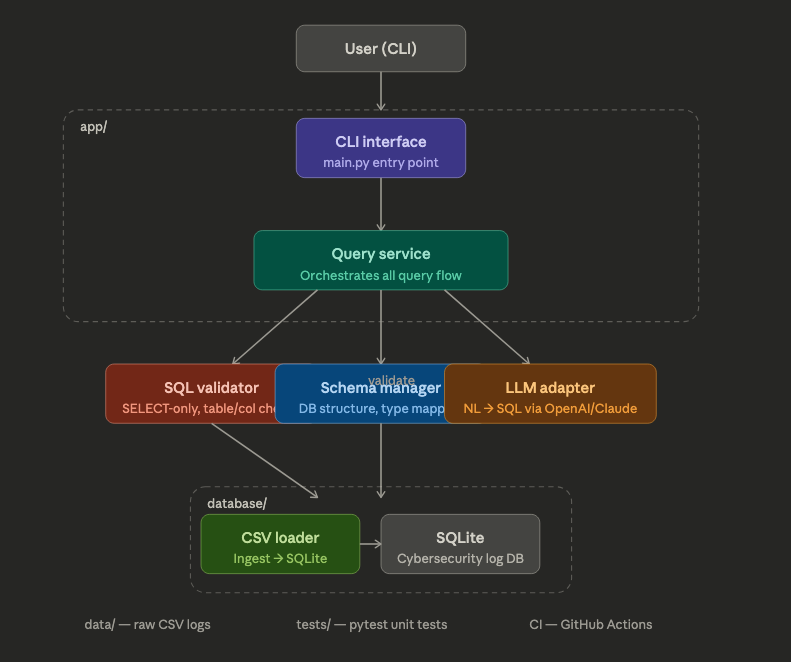

# DataQuery Engine
A modular natural language interface for querying structured data using SQL and LLMs, with built-in validation to ensure safe query execution.

The system translates user question into SQL using Claude (Anthropic), validates every query for safety, and execute it against a SQLite database. It works with any CSV file.


## Features

- Load any CSV file into SQLite automatically
- Ask questions in plain English — the LLM generates the SQL
- All generated SQL is validated before execution
- Only SELECT queries are allowed — no data modification possible
- Modular architecture with clear separation of concerns
- CLI interface for interactive use

## Architecture



| Module | Responsibility |
|---|---|
|`app/cli.py` | Entry point - user input loop, never touches DB directly |
|`app/query_service.py` | Orchestrates both flows: CSV ingestion and query processing |
|`app/llm_adapterpy` | Translates natural language to SQL via Claude API |
|`app/sql_validator.py` | Validates SQL before execution - SELECT only, known tables/columns, no injection |
|`database/schema_manager.py` | Understands DB structure - tables, columns, types |
|`database/csv_loader.py` | Loads any CSV into SQLite - manual row insertion, no df.to_sql() |
|`database/database.py` | SQLite connection management |

---

## Design Decisons 

**Generic CSV loader** - The system works with any CSV file regardless of column names or structure. Table schema is inferred automatically from the data types.

**Separation of concerns** — The CLI never accesses the database directly. All queries go through QueryService → SQLValidator → SQLite. This enforces a clear boundary between the user interface and the data layer.

**LLM output is untrusted** — SQL generated by the LLM is treated as untrusted input and must pass through SQLValidator before execution. The LLM Adapter never executes SQL — it only generates it.

**Partial normalization** — High-cardinality categorical columns can be normalized into lookup tables. Low-cardinality fields stay flat for simplicity.

**ValidationError** — A custom exception class so callers can catch validation failures specifically without catching unrelated errors.

---

## How to Run

### 1. Clone the repo
```bash
git clone https://github.com/your-username/SecureQuery.git
cd SecureQuery
```

### 2. Install dependencies
```bash
pip3 install pandas anthropic pytest
```

### 3. Add your API key
Create a `config.py` file in the project root:
```python
ANTHROPIC_API_KEY = "your-api-key-here"
MAX_TOKENS = 1024
```
> **Never commit config.py** — it is in `.gitignore`

### 4. Run the CLI
```bash
python3 app/cli.py
```

### CLI Commands
```
1. Load a CSV file          — load any CSV into a named table
2. Ask a question           — natural language query via LLM
3. List tables and columns  — show what's loaded in the DB
4. Exit
```

### Example session
```
Enter choice (1-4): 1
Enter path to CSV file: data/threats.csv
Enter table name to load into: threats
Done! 3000 rows created into 'threats'.

Enter choice (1-4): 2
Ask your question: What are the top 5 countries by total financial loss?
Generated SQL: SELECT "country", SUM("financial_loss_(in_million_$)") as total
               FROM threats GROUP BY "country" ORDER BY total DESC LIMIT 5
5 row(s) returned:
  UK           | 16502.99
  Germany      | 15793.24
  Brazil       | 15782.62
  Australia    | 15403.0
  Japan        | 15197.34
```

---

## How to Run Tests
```bash
pytest tests/ -v
```

Expected output: **33+ passed**

---

## LLM Usage Documentation

Per assignment requirements, here is where AI was used in this project:
| Module | How AI was used |
|---|---|
| `sql_validator.py` | Used Claude to help implement the validation logic. All tests and the API were designed independently. Claude-generated code was verified against our tests — two cases where it generated incorrect output were caught and fixed. |
| `llm_adapter.py` | Claude generates SQL at runtime from natural language input. All generated SQL passes through SQLValidator before execution. |
| All modules | Used Claude for code review and explaining concepts. Never used to generate full solutions or copy/paste modules. |

### LLM hallucination example caught by validator

During testing, the LLM generated SQL referencing a table called `incidents` that didn't exist:
```sql
SELECT * FROM incidents WHERE year = 2020
```
The validator raised `ValidationError: Unknown table 'incidents'` and blocked execution. This is captured in `test_llm_generated_wrong_table` in `tests/test_sql_validator.py`.

---

## Project Structure
```
SecureQuery/
├── app/
│   ├── cli.py              # User interface
│   ├── query_service.py    # Orchestrator
│   ├── llm_adapter.py      # LLM integration
│   └── sql_validator.py    # Query validation
├── database/
│   ├── csv_loader.py       # CSV ingestion
│   ├── schema_manager.py   # DB structure
│   └── database.py         # Connection management
├── tests/
│   ├── test_csv_loader.py
│   ├── test_schema_manager.py
│   ├── test_database_conn.py
│   ├── test_sql_validator.py
│   ├── test_query_service.py
│   └── test_llm_adapter.py
├── data/                   # CSV files go here
├── config.py               # API keys — not committed
├── requirements.txt
└── README.md
```

---

## Requirements
```
pandas
anthropic
pytest
```

---

## Limitations

- The LLM occasionally generates SQL with incorrect casing for string values (e.g. `'phishing'` instead of `'Phishing'`). This is mitigated by prompting Claude to preserve exact casing.
- Column names with special characters (e.g. `financial_loss_(in_million_$)`) require double-quoting in SQL — handled in the prompt instructions.
- The system does not support JOIN queries across unrelated tables.